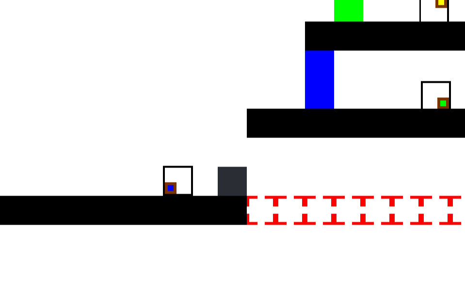

# Switch-Mania
Jeu de plateforme (indépendant) hébergé sur Gamejolt.com

# Introduction
Ayant utilisé le moteur de jeu Unity dans le précédent projet [Slimes](https://github.com/Sup3Legacy/Slimes) et ayant un goût prononcé pour les jeux de type **puzzle**, j'ai mis en pratique l'expérience que j'ai acquise avec ce moteur pour créer un jeu de plateforme puzzle.

Je l'ai publié sur [Gamejolt (lien du jeu)](https://gamejolt.com/games/switch-mania/488977), plateforme de jeux indépendants, avec une version téléchargeable et éxecutable (Windows) et une version jouable directement en ligne.

# Principe
Le joueur doit, dans chaque niveau, parvenir à la fin, signalée par un panneau *exit*. Pour ce faire, il doit activer et désactiver des **Activators**, sortes de plateformes de couleur qui ne sont solides qu'une fois activées. 

